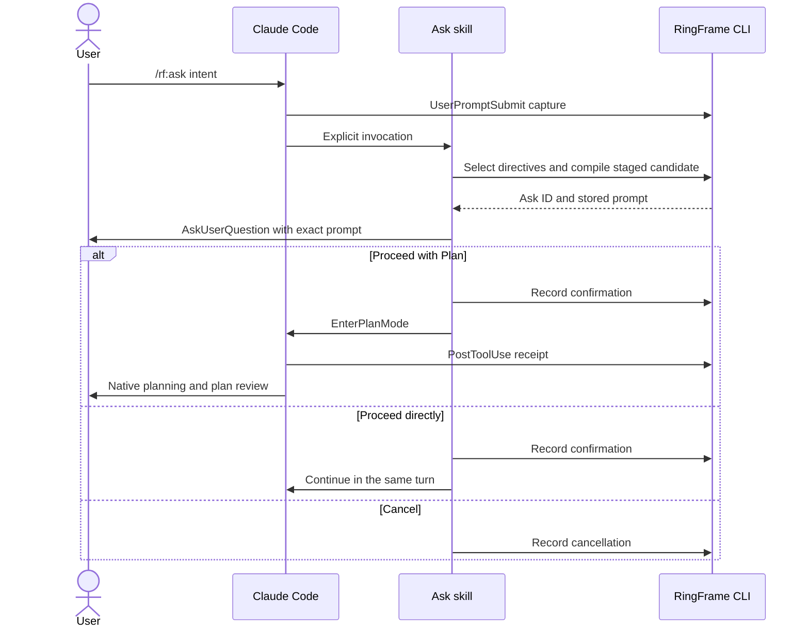

# Claude Code adapter

The `rf` plugin provides `/rf:ask`, `/rf:eval`, and `/rf:seal` as explicit-only
skills. Skills call the `ringframe` CLI for record writes; hooks capture prompt
and Plan activation evidence. See the [README](../../README.md#claude-code)
for installation.

## Ask path

Revisions compile a successor candidate and return to confirmation. Plan
activation records `native_accepted` only when the hook supplies its receipt;
it does not resubmit the prompt as a new user message. Direct continuation has
no delivery receipt. On activation error, the skill reports failure and offers
the stored prompt for manual handoff.

## Profile and limits

The [shipped profile](../../core/ringframe/profiles/claude-code.yaml) matches
`>=2.1.260 <2.2`. This is a routing range, not proof of every version in that
range. Unknown versions use the unknown profile; a capability absent from that
profile is refused until the caller selects `human_handoff`.

The Ask skill exposes Plan and direct execution. The profile also defines a
manual Goal route, which this skill does not offer. Both hooks exit 0 on errors;
missing hook evidence leaves source or delivery unverified.

## Earlier host evidence

The Fab7 HostLab evidence index reports these predecessor results:

| Qualification | Artifact and surface | Reported scope |
| --- | --- | --- |
| `ringframe-ask-ledger-q07` | `156a8bf`; Claude Code 2.1.263 through Agent SDK; Sonnet 5, low | 3/3 composed Asks with audited Rules, native confirmation, Plan activation receipt, and clean ledger |
| `ringframe-loop-q05` | `007ac50`; same host/model surface | 3/3 two-Ask loops with the earlier Eval and Seal design |

These references identify historical artifacts retained in Fab7 HostLab, not
qualification of this release candidate or a general native-TUI claim. The
current judged Eval and edited skill instructions need fresh qualification.
Prompt quality and improvement over a native baseline require separate evidence.
