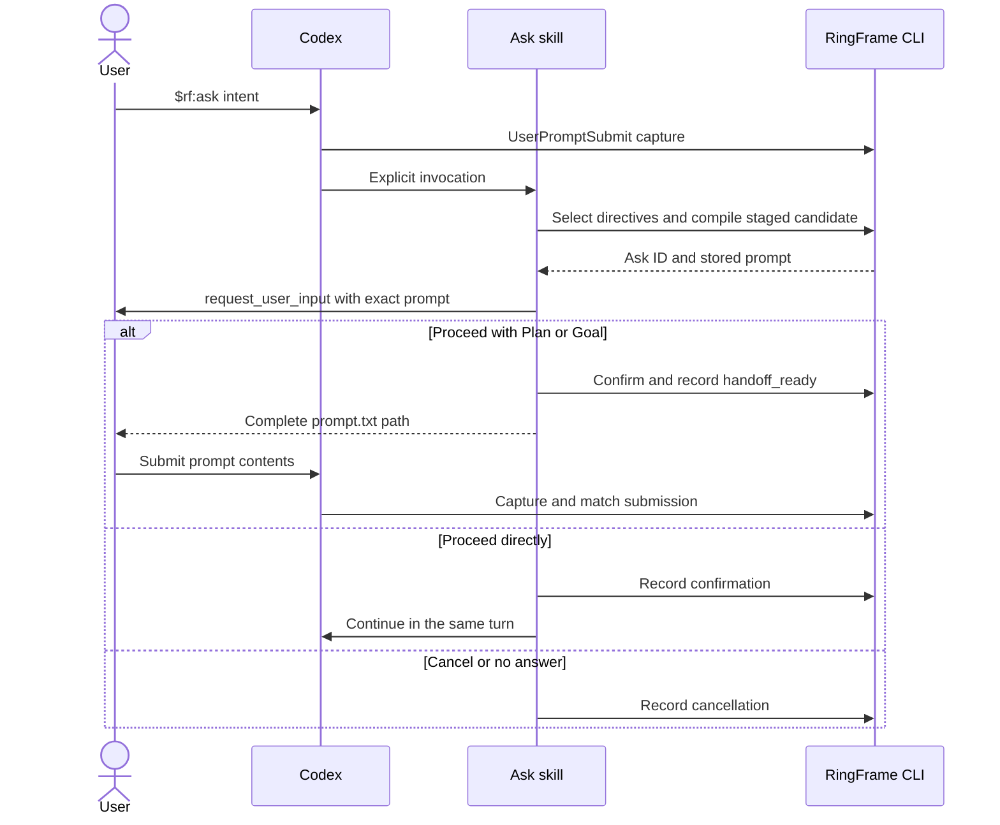

# Codex adapter

The `rf` plugin provides `$rf:ask`, `$rf:eval`, and `$rf:seal` as explicit-only
skills. RingFrame's Codex adapter uses manual handoff for Plan and Goal routes;
direct execution continues in the same turn.

## Setup

Follow the [README](../../README.md#codex) to install. Enable
`default_mode_request_user_input` for native confirmation outside Plan mode.
In Codex, open `/hooks` and trust the `rf@ringframe` UserPromptSubmit hook.
Without capture, RingFrame cannot verify the source or observe pasted input.

## Ask path



Revisions compile a successor candidate and return to confirmation. A handoff
is not a submission receipt. The hook can record a matching submission;
`ask submitted` records only a caller's attestation.

## Profile and limits

The [shipped profile](../../core/ringframe/profiles/codex.yaml) matches
`>=0.153.0 <0.154`. This routing range is broader than the exact tested build.
It supplies `/plan ` and `/goal ` prefixes and a 4,000-character Goal limit.
Outside the range, callers must select the unknown profile's `human_handoff`
capability; compiling a named native capability is refused.

- Matching tolerates a dropped trailing newline or host-stripped capability
  prefix and records which form matched.
- If the chooser returns no answer, the skill cancels. Host behavior after
  dismissal remains outside RingFrame's control.
- Identical Ask text in multiple recent captured sessions makes automatic
  session lookup ambiguous. A repeat within one session alone does not.
- Eval can fall back to sequential judge passes when sub-agents are unavailable;
  these are marked `shared_context`, not independent agents.

## Eval delegation

For an explicit request for the intended four native judges, use:

```text
$rf:eval — explicitly use four native sub-agents for this evaluation.
```

The skill requests an intent judge followed by coverage, drift, and adversarial
assessors. Codex owns spawning and permissions. A pending command or unread
tool result does not establish that delegation is unavailable. When a native
sub-agent tool is absent or reports unavailability, the fallback records
`shared_context`.

The diagnostic `ringframe-eval-delegation-codex-q01` used candidate `3edcbac`,
Codex 0.153.4 and `gpt-5.6-terra` at low effort: the plain invocation used four
native judges in 1/3 runs, the explicit request in 3/3. All six completed Eval.
This small sample supports the explicit wording; it does not prove a hard
permission requirement or guarantee delegation. It does not qualify changed
skill bytes or the complete workflow.

## Earlier host evidence

The Fab7 HostLab evidence index reports these predecessor results:

| Qualification | Artifact and surface | Reported scope |
| --- | --- | --- |
| `ringframe-ask-codex-q07` | `156a8bf`; Codex 0.153.4 through app-server; gpt-5.6-terra, low | 3/3 composed Asks, native confirmation, handoff, clean ledger; no submission claim |
| `ringframe-loop-codex-q07` | `5190802`; same host/model surface | 3/3 two-Ask loops with observed input and the earlier Eval and Seal design |
| `ringframe-ask-codex-tui-q01` | Codex 0.153.4; one human TUI run card | Paste-path observations with ambiguity and chooser findings; not release qualification |

These references identify historical artifacts retained in Fab7 HostLab.
The current judged Eval and edited skill instructions need fresh qualification.
Earlier app-server results do not establish native-TUI parity, revision/cancel
coverage, or prompt quality.
