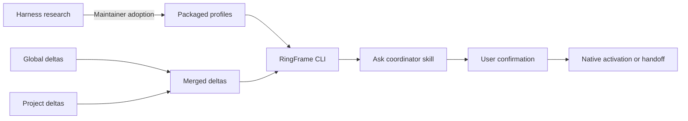

# Prompt compiler

The CLI selects instruction deltas from YAML catalogs; the skill composes them
into a task brief. Every candidate stages `source.txt` plus exactly one form:

| File | Processing | `compiler.source` |
| --- | --- | --- |
| `composed.txt` | Add the capability prefix; audit labelled `Rules:` lines against supplied directives. | `composed` |
| `body.txt` | Add the prefix and append selected directives verbatim. | `body` |
| `prompt.txt` | Preserve the supplied complete prompt; validate any required prefix. | `prompt` |

`composed.txt` is the shipped skills' default; `body.txt` is a rendering baseline;
`prompt.txt` is the legacy input. All forms validate concerns and capability
length limits. Only the composed and body forms record catalog selection
provenance; legacy input records `compiler.source` alone.

## Research, profiles, and the coordinator



Harness research establishes documented mechanisms and evidence gaps. Maintainers
map the subset RingFrame uses into `core/ringframe/profiles/`; each capability
carries primary source URLs. Research documents stay outside the installed
product and are not read during Ask.

`ringframe profile show --host <host> --json` exposes the profile's routing
guidance and precedence, capability selection criteria, effects, confirmation,
activation, continuation, delivery mode, and limitations. The coordinator reads
this data before selecting a capability. It infers the intended outcome and
continuation; users do not need to name native commands. Profiles remain
package-owned and version-independent.

The coordinator reads the merged concern vocabulary from `ringframe deltas list`
when needed, then obtains selected directives with `ringframe deltas render`.
It composes the brief, calls `ringframe ask compile`, and presents the stored
prompt for confirmation. After confirmation, delivery follows the selected
profile entry. Skills own this workflow; they do not contain a second routing
table. The CLI validates the declared capability and records its profile digest;
semantic suitability remains a model decision, evaluated probabilistically.

## Catalogs

The CLI reads global catalogs in `~/.fab7/rt/deltas/` and merges project
configuration from `.fab7/rt/deltas/`. Project fields win conflicts. Practice
rules match task classifications; host rules match capability IDs.

See [delta configuration](delta.md) for file layouts, extension fields, merge
rules, priorities, selection budgets, and examples.

Composed `Rules:` lines use supplied labels as traceability tags. The CLI
audits labels and records applied and omitted directives; it does not judge
whether the wording correctly applies the rule.

## Inspect and trace

```sh
ringframe deltas list --effective --json
ringframe deltas render --host codex --capability native_plan \
  --classification '{"task":["implement"],"result":"workspace_change","interaction":"approval_gated","horizon":"session","effects":["write"],"concerns":["api_surface"]}' --json
```

`ask.compiled.data.compiler` records catalog digests, selected IDs, matching
concerns, and budget omissions for rendered forms. Practice provenance includes both the
shipped and effective catalog digests, plus the contributing file digests. Composed input also records
applied and omitted IDs. Catalog identities hash canonical JSON parsed from YAML.

The Claude Code and Codex host catalogs each contain three candidate additions
and are excluded by default. The practice catalog supplies the active default
Rules. Catalog `matrix_ref` URLs and evidence identifiers are descriptive
references; the CLI does not fetch them or require a documentation checkout.

Candidate text and successful composition alone do not establish improvement over the
native prompt baseline. [Eval](../commands/eval.md) compares the resulting diff with effective intent.

Implementation: [catalog selection and rendering](../../core/ringframe/deltas.py).
