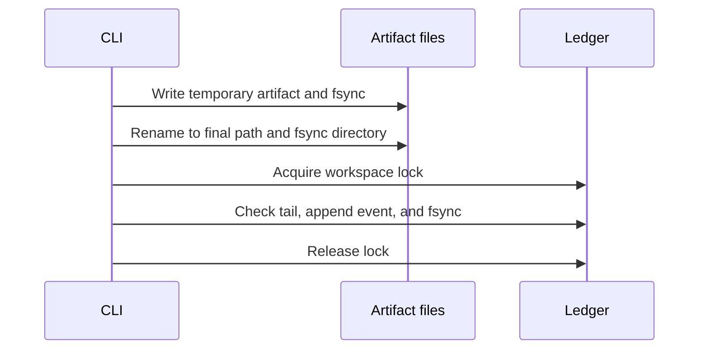

# Workspace ledger

The CLI stores records under `.fab7/rf/` in the consumer workspace. The root is
`--workspace` when supplied, otherwise the Git worktree root or current directory.
Initialization creates a `.gitignore` containing `*` and sets the RF directory
to owner-only access.

## Files

Paths below are relative to `.fab7/rf/`.

| Path | Contents |
| --- | --- |
| `ledger.jsonl` | Append-only canonical JSON events |
| `lock` | Advisory lock around the final append |
| `asks/<ask_id>/source.txt` | Published source intent for one candidate |
| `asks/<ask_id>/prompt.txt` | Published prompt for one candidate |
| `evals/<eval_id>/brief.json` | Open Asks and Git facts |
| `evals/<eval_id>/intent.json` | Judged intent items |
| `evals/<eval_id>/judgement-<n>.json` | Assessor votes and path classifications |
| `evals/<eval_id>/record.json` | Aggregated Eval |
| `seals/<seal_id>.json` | Decision receipt |
| `authorizations/<actor_id>.json` | Optional local authorization grant |
| `sessions/<host>/<session>/` | Prunable hook captures |
| `tmp/` | Staging files; may remain after interruption |

## Writes and checks



Publication and append are separate operations, not one transaction. A crash
can leave unreferenced artifacts. Final artifacts are not intentionally
rewritten; corrections use new records. Digests check consistency against the
ledger, not authenticity against a malicious local writer.

```sh
ringframe ledger verify --json
ringframe sessions prune --older-than 7d --json
```

Verification reports torn tails, invalid JSON or schema identifiers, missing or
changed artifacts, unreferenced artifacts, dangling links, duplicate deliveries,
and delivery without confirmation. It repairs nothing and returns exit 2 for
findings. Full event validation runs in command writers via
[`schema.py`](../../core/ringframe/schema.py); verification is not a full schema audit.
Pruning removes old session captures, not Ask, Eval, or Seal artifacts, and can
reduce later source-verification evidence and ordinary-prompt counts.

## Events

Each `ringframe.ledger/1` line has `schema`, `event_id`, `type`, `time`, `id`,
`actor`, `links`, and `data`. Artifact references carry a relative path, role,
byte count, and SHA-256.

| Operation | Events |
| --- | --- |
| Ask | `ask.compiled`, `ask.confirmed`, `ask.cancelled`, `ask.delivery`, `ask.submission` |
| Eval | `eval.opened`, `eval.completed` |
| Seal | `seal.created`, `seal.refused` |

Opaque IDs use `ask_`, `evt_`, `evl_`, or `sel_` followed by 26 Crockford Base32
characters. Use links and record fields for relationships, not ID parsing.

CLI exit codes: `0` success, `1` usage error, `2` refusal or failed check,
`3` needs input, `4` internal error. See [Security](../../SECURITY.md) for retained data.

Implementation: [publication and verification](../../core/ringframe/store.py),
[workspace initialization](../../core/ringframe/workspace.py), and
[session captures](../../core/ringframe/sessions.py).
