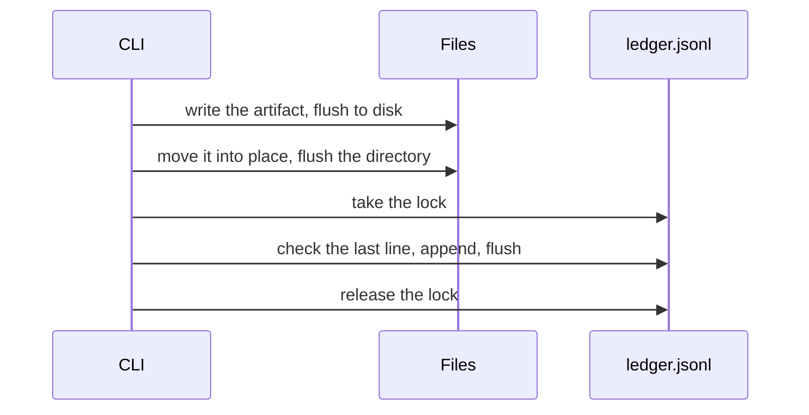

# Records

Everything RingFrame writes for a project lives in that project's `.fab7/rf/`.
Nothing is sent anywhere.

The project is the directory you run in, or `--workspace <path>` if you pass
it. Hooks use the directory the host reports. A project nested inside a bigger
repository keeps its own records — RingFrame does not walk up to the enclosing
repo. Eval only looks at changes inside the project it was run in.

`ringframe init` sets up a project. It creates `.fab7/rf/`, makes it
owner-only, and makes it ignore itself so your records never land in a commit.
It also creates one empty rules file you can fill in later.

`ringframe init --global` is a different thing: it sets up your machine, not a
project. See [Rules](delta.md) for what it installs and where.

Records already on disk are never moved, merged, or rewritten by an upgrade.

## What is in the folder

Paths are relative to `.fab7/rf/`.

| Path | What it holds |
| --- | --- |
| `ledger.jsonl` | The log. One line per event, append-only |
| `asks/<id>/source.txt` | Your words, exactly as you typed them |
| `asks/<id>/prompt.txt` | The prompt that was built from them |
| `evals/<id>/brief.json` | The facts a judge was given |
| `evals/<id>/intent.json` | What the work was judged against |
| `evals/<id>/judgement-<n>.json` | One judge's votes |
| `evals/<id>/record.json` | The verdict, with agreement |
| `seals/<id>.json` | Your decision, as a receipt |
| `deltas/` | Rules you set for this project ([Rules](delta.md)) |
| `authorizations/<actor>.json` | Optional: who may act on your behalf |
| `sessions/<host>/<id>/` | What the host's hooks captured. Safe to prune |
| `lock`, `tmp/` | Working files. `tmp/` may survive an interrupted run |

## How a record is written



The file and the log line are two steps, not one. So a crash in between can
leave a file nothing points at — harmless, and `verify` will tell you. Finished
files are never edited afterwards; a correction is a new record, so the history
stays honest.

One limit worth stating plainly: digests prove a file has not changed *by
accident*. They do not prove nobody with write access to your disk changed it
on purpose.

## Checking and tidying

```sh
ringframe ledger verify --json
ringframe sessions prune --older-than 7d --json
```

`verify` looks for a truncated last line, bad JSON, missing or altered files,
files nothing references, broken links, a delivery recorded twice, and a
delivery with no confirmation before it. It reports and repairs nothing, and
exits `2` if it finds anything. It is a consistency check, not a full audit —
every command validates its own events as it writes them.

`prune` deletes old session captures only. Asks, Evals, and Seals are never
touched. The trade-off: pruning can remove the evidence that would later prove
a prompt was submitted word for word.

## The log itself

Every line carries `schema`, `event_id`, `type`, `time`, `id`, `actor`,
`links`, and `data`. A reference to a file records its path, role, size, and
SHA-256.

| Command | Events it writes |
| --- | --- |
| Ask | `ask.compiled`, `ask.confirmed`, `ask.cancelled`, `ask.delivery`, `ask.submission` |
| Eval | `eval.opened`, `eval.completed` |
| Seal | `seal.created`, `seal.refused` |

IDs look like `ask_`, `evt_`, `evl_`, or `sel_` followed by 26 characters. They
are opaque: read the `links` and the record fields to find relationships, never
the ID text.

Exit codes: `0` fine, `1` you typed something wrong, `2` refused or a check
failed, `3` it needs an answer from you, `4` a bug.

What is kept and what is not: [SECURITY.md](../../SECURITY.md).
