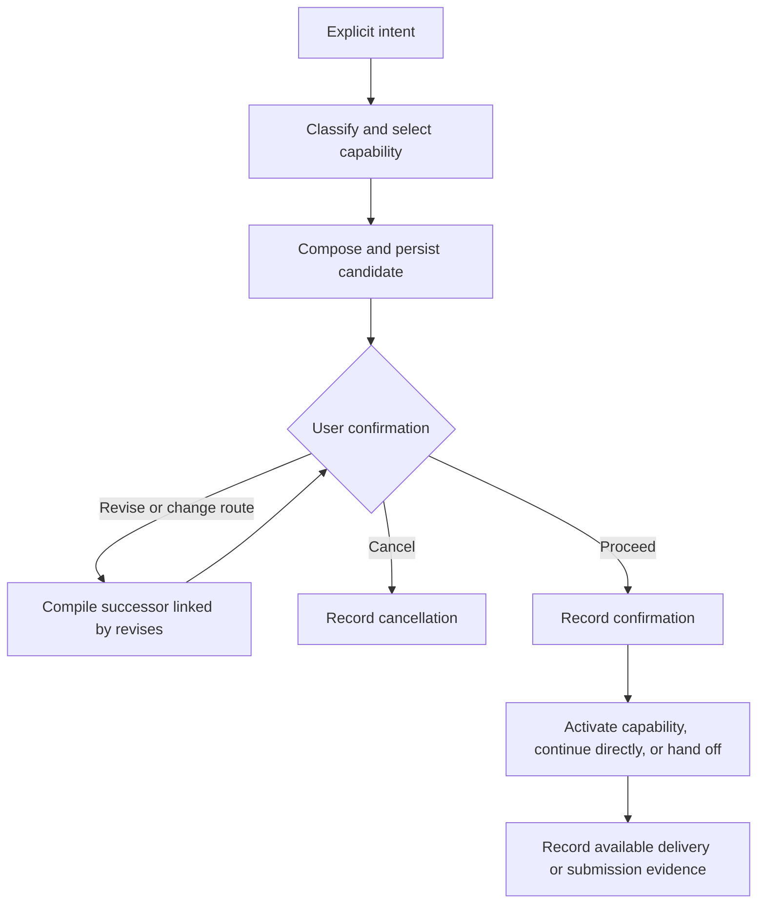

# Ask

Ask turns an explicit intent into a prompt for a native host capability. The
skill proposes the route and wording; the CLI validates and stores the
candidate before the user confirms it.

| Claude Code | Codex |
| --- | --- |
| `/rf:ask <intent>` | `$rf:ask <intent>` |



## Routing and compilation

Classify only the task, result, interaction, horizon, effects, and optional
concerns needed for routing. Preserve the user's constraints without inventing
project context, permissions, or acceptance requirements.

The shipped skills prefer `native_plan` for work with effects and
`native_direct` for read-only work or an explicit request to act immediately.
The CLI requires `route.explicit_direct_request=true` for direct execution with
specified write, execute, or external effects; the skill supplies that assertion.
Codex also offers `native_goal` for a continuing objective. Host profiles define
capabilities and delivery modes. The CLI refuses capabilities absent from the
selected profile; it cannot check whether the current host exposes their tools.

The [compiler](../architecture/compiler.md) selects directives. The skill
composes a task brief with labelled `Rules:` lines, then stages `source.txt`
and `composed.txt`. The CLI publishes `source.txt` and `prompt.txt`, records
byte counts and SHA-256 digests, and appends `ask.compiled`.

Each compile creates a new `ask_id`, including revisions shown in the chooser.
Revisions link to the previous Ask with `revises`; remediation can link to an
Eval with `remediates`. Published candidates are never overwritten.

## Confirmation and delivery

The skill is instructed to present the complete stored prompt, route,
continuation, and expected effects. Proceed records `ask.confirmed`; cancel records
`ask.cancelled`. Confirmation is reported by the skill, not independently
verified by the CLI. Unanswered candidates can remain compiled but unconfirmed.

| Observation | Meaning |
| --- | --- |
| `native_accepted` | A hook receipt records native capability acceptance. |
| `handoff_ready` | The prompt is available for the user to submit. |
| `delivery_failed` / `unavailable` | Delivery failed or is unavailable. |
| No delivery event | No recorded delivery outcome; includes direct continuation. |
| Submission `observed` | A prompt hook matched the compiled input. |
| Submission `attributed` | A caller attested submission with `ask submitted`. |

Source verification requires a matching captured Ask in the resolved session;
comparison tolerates one final newline. Missing or ambiguous captures leave
`source_verified` as `unverified`. Submission matching also supports a dropped
trailing newline or host-stripped capability prefix and records the match type.
None of these observations proves execution, completion, or prompt quality.

## Host integration

Profiles are selected by recognized host name, independently of version.
Stable IDs are `claude-code` and `codex`; an unrecognized host uses `unknown`
with `human_handoff`. Profile digests identify the configuration; captured
host versions are provenance. There is no model pin or host-version window.
Profile selection does not establish tool availability or support for every
past or future host build.

The following paths are requested by the shipped skills. Host permissions
control tool execution.

### Claude Code

The [Ask skill](../../plugins/claude/skills/ask/SKILL.md) presents the stored
prompt through `AskUserQuestion`. After confirmation, `native_plan` calls
`EnterPlanMode`; the PostToolUse hook records `native_accepted` from its receipt.
The confirmed prompt stays in the current context. The host owns planning,
plan review, and subsequent work. On activation error, the skill records failure
and offers the stored prompt for manual handoff.

`native_direct` continues in the same turn and has no delivery receipt. The
[profile](../../core/ringframe/profiles/claude-code.yaml) also declares a manual
Goal route, but the Claude Ask skill offers only Plan and direct execution.

### Codex

The [Ask skill](../../plugins/codex/skills/ask/SKILL.md) requires
`request_user_input` in the current turn. Missing or rejected confirmation
stops it without confirming; no answer cancels the candidate. See
[Codex setup](../../README.md#codex) for tool availability and prompt-hook trust.

The [profile](../../core/ringframe/profiles/codex.yaml) uses manual handoff for
Plan and Goal. The CLI adds `/plan ` or `/goal `, with a 4,000-character Goal
limit. After confirmation, the skill records `handoff_ready` and supplies the
complete `prompt.txt` path for the user to submit. The prompt hook can then
record a matching submission. `native_direct` continues in the same turn.

Both hosts capture explicit invocations through UserPromptSubmit hooks. Hook
errors do not block the host; absent capture leaves source or submission
unverified. Identical Ask text captured in multiple recent sessions makes
automatic session lookup ambiguous.

## Inspect records

```sh
ringframe ask list --json
ringframe ask show --ask <ask_id> --json
ringframe ask copy --ask <ask_id>
```

`ask copy` prints the exact prompt. Without an ID, `ask show` resolves a unique
record using session or workspace context; ambiguity returns `needs_input`
(exit 3). Explicit references may use an ID or unique title substring. The CLI
does not choose a record merely because it is newest.

Implementation: [Ask records and resolution](../../core/ringframe/ask.py).
