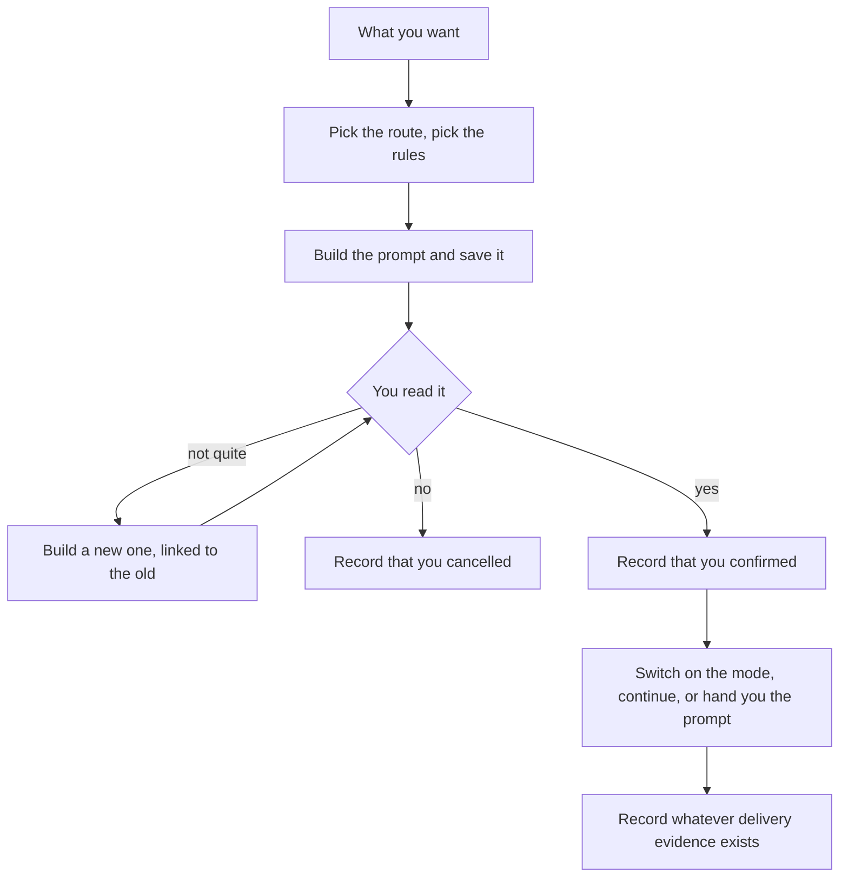

# Ask

**You say what you want. Ask writes the prompt, shows it to you, and only sends
it once you say yes.**

| Claude Code | Codex |
| --- | --- |
| `/rf:ask <what you want>` | `$rf:ask <what you want>` |



## Building the prompt

Your agent works out a few things about your request: is it planning or
implementing, does it write files, how long does it run, what is it about. Just
enough to route it. It does not invent requirements or guess at project
context, and it keeps your constraints as you stated them.

Then it reads the profile — the list of things your agent can do and when each
fits — and picks a route. You never have to name a native command. A long
running objective can route to Goal instead of the usual Plan. If you asked for
a plan only, or a review only, that stays a plan or a review.

Two guards from the CLI: it refuses a route the profile does not list, and it
refuses to run straight into writing files unless your request itself asked to
skip planning. What it cannot tell you is whether the route was a *good* choice,
or whether your host really exposes that tool right now.

Then [the prompt gets built](../architecture/compiler.md), saved, and shown to
you. Your exact words go to `source.txt`, the prompt to `prompt.txt`, both with
their size and checksum recorded.

Every compile makes a new Ask, revisions included. A revision links back to the
one it replaces; a fix for a failed Eval can link to that Eval. Nothing already
saved is ever overwritten.

## Confirming, and what happens after

The skill shows you the whole prompt, the route, what happens next, and what it
will touch. Yes records a confirmation; no records a cancellation. You can also
just leave it — an unconfirmed prompt stays on the books until you deal with it.

The confirmation is reported by the skill. The CLI writes down that it was
reported; it cannot independently watch you click.

After that, what gets recorded depends on what can actually be observed:

| What you see | What it means |
| --- | --- |
| `native_accepted` | A hook saw your agent switch modes. This really happened. |
| `handoff_ready` | The prompt is ready for you to paste. Nobody watched you paste it. |
| `delivery_failed` / `unavailable` | It could not be delivered. |
| no delivery event | Nothing was observed — including work that just continued in the same turn. |
| submission `observed` | A hook caught the prompt going in, and the bytes matched. |
| submission `attributed` | You told us it went in, with `ask submitted`. |

**None of these mean the work was done, or done well.** They are about delivery
only.

For byte matching: a trailing newline difference is tolerated, as is a host
stripping the `/plan ` prefix, and the match type is recorded. If the capture is
missing or several sessions look alike, it stays `unverified` rather than
guessing.

## How each host behaves

The profile is chosen by host name — `claude-code` or `codex` — not by version.
An unknown host falls back to handing you the prompt. Host versions are recorded
as provenance, nothing more. Knowing the profile does not prove the tool is
available in your session right now.

Your host's own permissions still control every tool call below.

### Claude Code

The [Ask skill](https://github.com/fab7hq/fab7/blob/main/products/ringframe/plugins/claude/skills/ask/SKILL.md)
shows you the prompt with `AskUserQuestion`. Say yes on the Plan route and it
calls `EnterPlanMode`; a hook catches that and records `native_accepted`. The
prompt stays in your current conversation, and Claude Code owns the planning and
review from there. If switching modes fails, the skill records the failure and
hands you the prompt instead.

Direct execution just continues in the same turn, so there is nothing to
receipt. The
[profile](https://github.com/fab7hq/fab7/blob/main/products/ringframe/config/harnesses/claude-code.yaml)
also has a Goal route you submit yourself.

### Codex

The [Ask skill](https://github.com/fab7hq/fab7/blob/main/products/ringframe/plugins/codex/skills/ask/SKILL.md)
needs `request_user_input` in the turn. If it is missing or you decline, the Ask
stops without confirming; no answer cancels it. See
[Codex setup](../usage/codex.md#prerequisites).

On Codex you submit the prompt yourself. The
[profile](https://github.com/fab7hq/fab7/blob/main/products/ringframe/config/harnesses/codex.yaml)
hands off for Plan, Goal, and Review; the CLI adds the `/plan `, `/goal `, or
`/review ` prefix, with a 4,000-character cap on Goal. You get the path to
`prompt.txt`, and when you submit it the prompt hook can record the match.

Both hosts capture your `/rf:ask` line through a hook. If a hook fails your
session carries on as normal — you just lose that piece of evidence.

## Looking at your Asks

```sh
ringframe ask list --json
ringframe ask show --ask <ask_id> --json
ringframe ask copy --ask <ask_id>
```

`ask copy` prints the exact prompt, ready to paste. `ask show` without an ID
finds the one you mean from context; if that is ambiguous it asks rather than
guessing, and it will never pick a record just because it is the newest.
