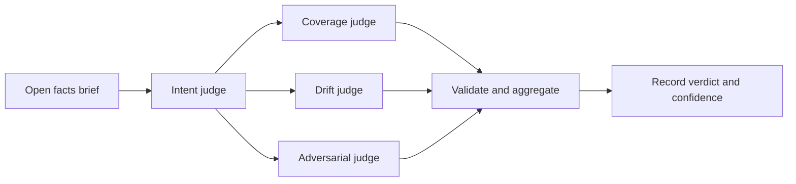

# Eval

Eval judges the current work against every open Ask and records `verdict` and
`confidence`. Invoke `/rf:eval` in Claude Code or `$rf:eval` in Codex.
The skill instructs the host to ask no questions and run no project builds or
tests. These instructions do not sandbox the host. For Codex,
use the [explicit delegation request](eval.md#native-delegation)
when requesting four native judges.



Eval compares the resulting diff with the effective confirmed intent to find
omissions and unexplained changes. It does not audit the implementation
sequence, such as whether the agent followed TDD. Evaluating a delta’s effect
on that behavior belongs in a separate experiment.

## Basis and subject

An Ask is open from `ask.compiled` until cancellation or a Seal names it.
The brief lists open Asks in compilation order. Judges treat unconfirmed
candidates as context and reconstruct obligations from confirmed Asks, including
later revisions and withdrawals. Ordinary prompt text is not retained; counts
come from available hook captures and can explain otherwise unexplained changes.

Eval requires Git. Anchor selection uses an explicit `--anchor` first, then
the latest Seal's subject if it is a Git commit, then the first available base
commit among the open Asks. Otherwise it returns `eval.anchor_unknown` (exit 3).
A Seal of a dirty worktree does not itself supply a commit anchor.

The default subject is `HEAD` for a clean tree, otherwise the worktree:

| Kind | Reference | Digest |
| --- | --- | --- |
| `git_commit` | Commit ID | Git tree hash at the repository root; SHA-256 of the project subtree listing for a nested project |
| `worktree` | Absolute root | SHA-256 over sorted file paths, modes, and content digests, including untracked non-ignored files |

## Judgement and aggregation

`eval open` writes a brief with Ask paths, anchor, subject digest, changed-file
counts, earlier Evals sharing an Ask, and limitations. An existing unclosed
Eval over the same Asks returns `eval.already_open`; continue with that ID.

The skill requests one intent judge to produce `active`, `revised`, or
`withdrawn` items traced to Asks. Three assessors (`coverage`, `drift`, `adversary`) each vote
`yes`, `no`, or `unknown` on active items and classify every changed path as
`required`, `consequence`, or `unexplained`. Judges are instructed to write only
their staged output files. Both skills allow four sequential passes marked
`shared_context` only when the native agent tool is absent or explicitly
reports unavailability; the reason must be disclosed. A pending result or
file permission denial does not justify that fallback.

`eval close` requires at least three judgement files bound to the brief digest,
votes covering active items, and classifications covering changed paths. The
CLI records reported judge identity and independence; it does not authenticate
judges or prove that their contexts were separate.

| Verdict | Aggregation rule |
| --- | --- |
| `aligned` | All active items resolve to `yes`, with no unexplained path. |
| `drifted` | With active items, an item resolves to `no`, or a path resolves to `unexplained`. |
| `incomplete` | No active items, unresolved item votes without a drift finding, or a subject that changed during Eval. |

The output field `majority` uses the most frequent vote, even with more than
three judges. Item ties resolve to `unknown`; path ties resolve to `unexplained`.
Confidence is the lowest agreement among deciding questions, not a probability
of correctness. These are all active items and paths with a non-`required`
result or judge disagreement. With none, confidence is `0.0`. No active items
always yields `incomplete`; a changed subject also overrides the verdict to
`incomplete`.

## Native delegation

The coordinator is the host agent executing the Eval skill. The skill asks it
to spawn one intent judge, then three assessors together, collect their files,
and submit them to `eval close`. The RingFrame CLI does not spawn agents.

| Host | Skill instructions |
| --- | --- |
| [Claude Code](https://github.com/fab7hq/fab7/blob/main/products/ringframe/plugins/claude/skills/eval/SKILL.md) | Use foreground `Agent` calls, `Read` for evidence, and `Write` for judge files. |
| [Codex](https://github.com/fab7hq/fab7/blob/main/products/ringframe/plugins/codex/skills/eval/SKILL.md) | Request fresh native agent contexts (`fork_turns: "none"` when exposed). Read evidence with a native file tool or one plain `cat` call; collect completed command and agent results. |

Both skills share the intent and judgement schemas, all-item/all-path coverage,
fallback conditions, validation-error recovery, and reporting instructions.
These are instructions, not evidence that a host followed them.

In Codex, explicitly request sub-agents when invoking Eval to authorize spawning
the reviewers. Include this instruction even when native sub-agent tools are
enabled; do not rely on `$rf:eval` alone to request delegation:

```text
$rf:eval use native sub-agents
```

This wording cannot grant a missing tool or guarantee spawning. The host owns
permissions and delegation availability. A pending command or unread tool
result is not evidence that delegation is unavailable.

## Records and CLI

Each `evals/<eval_id>/` holds `brief.json`, `intent.json`, `judgement-<n>.json`,
and `record.json`. The record includes votes, omission and commission findings,
limitations, and a delta from the latest completed Eval sharing an Ask.
The delta matches items by ID within the same Ask, then normalized text, then
token overlap within the same Ask. This is a heuristic comparison, not proof
that reworded obligations mean the same thing.
The ledger records `eval.opened` and `eval.completed`.

```sh
ringframe eval open --json
ringframe eval close --eval <eval_id> --intent @intent.json \
  --judgement @coverage.json --judgement @drift.json --judgement @adversary.json --json
ringframe eval list --json
```

Eval never blocks [Seal](seal.md).

Implementation: [brief, validation, and aggregation](../../core/ringframe/evaluate.py).
