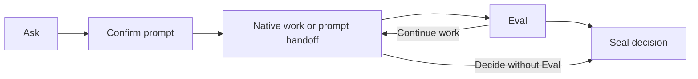

# Product contract

RingFrame connects explicit intent, evaluation, and decisions inside a native
AI coding host. It provides a Python CLI and separate Claude Code
and Codex plugins, each named `rf`.

| Operation | Durable result |
| --- | --- |
| [Ask](commands/ask.md) | Source intent, compiled prompt, confirmation, and delivery observations |
| [Eval](commands/eval.md) | Judgement of a Git subject against all open Asks, with confidence |
| [Seal](commands/seal.md) | Decision closing the open Asks, with an optional Eval reference |

This is a typical use, not a required workflow. Ordinary conversation can
continue between commands. Eval requires open Asks; Seal can close them without
an Eval. Compiled, unconfirmed candidates remain visible as context until
cancelled or sealed.

## Ownership

| RingFrame | Native host |
| --- | --- |
| Preserve staged intent and prompt bytes | Discover project context |
| Select directives and record a capability route | Choose tools, workflow, and execution sequence |
| Record confirmation and delivery evidence | Manage conversation, permissions, and approvals |
| Bind judgements to a recorded subject | Perform the requested work |
| Record an attributable decision | Execute separately authorized external effects |

The CLI validates records and aggregates submitted judgements. Skills guide
routing, confirmation, and judging; their instructions do not enforce host
behavior. The host is configured to load these skills only on explicit
invocation, but the CLI remains callable independently.

Claude skills set
[`disable-model-invocation: true`](https://code.claude.com/docs/en/skills#control-who-invokes-a-skill).
Codex skills set
[`policy.allow_implicit_invocation: false`](https://github.com/openai/codex/blob/main/codex-rs/skills/src/assets/samples/skill-creator/SKILL.md)
in `agents/openai.yaml`.

## Boundaries

- Records live in the consumer workspace's `.fab7/rf/`, ignored by Git by
  default. See [Ledger](architecture/ledger.md) for layout and retention.
- RingFrame does not maintain reusable project memory, impose development
  phases, retry the host, merge, publish, or deploy.
- Delivery evidence describes activation or submission, not completion.
- Eval compares the resulting diff with effective intent; it does not audit
  the implementation process. Confidence measures judge agreement, not
  probability of correctness.
- Seal records a caller's decision. Downstream systems choose their own gates.

The command references describe CLI semantics and the host integration paths.
They are not host qualification reports. Deterministic tests check CLI
mechanisms; prompt quality, judge reliability, and improvement over native work
require separate empirical evidence.

## References

Start with the [README](../README.md) for installation and first use.
[Claude Code](usage/claude.md) and [Codex](usage/codex.md) cover provider setup;
[delta configuration](architecture/delta.md) covers personal and project rules.
[Ask](commands/ask.md), [Eval](commands/eval.md), and [Seal](commands/seal.md)
describe the commands. [Ledger](architecture/ledger.md) covers local records;
[Compiler](architecture/compiler.md) covers prompt rules and provenance.

Contributors follow [AGENTS.md](../AGENTS.md) and
[LLM_VERIFICATION.md](../LLM_VERIFICATION.md) for model tests. Data handling is
covered by [SECURITY.md](../SECURITY.md). Research, release planning, and
qualification records are maintained outside this repository.
