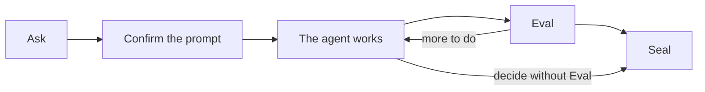

# What RingFrame is

You already tell a coding agent what to do. RingFrame writes down what you
asked, checks what came back, and records what you decided about it.

Three commands, inside Claude Code or Codex:

| Command | What it does | What it leaves behind |
| --- | --- | --- |
| [**Ask**](commands/ask.md) | Turns your intent into a prompt you read and confirm before it runs | Your words, the prompt, your confirmation |
| [**Eval**](commands/eval.md) | Checks the work against every Ask still open | A verdict, and how much the judges agreed |
| [**Seal**](commands/seal.md) | Closes those Asks with your decision | A receipt you can verify later |

That is the usual path, not a required one. Talk to your agent normally in
between. Eval needs at least one open Ask; Seal can close Asks without one. A
prompt you compiled but never confirmed stays visible until you cancel or seal
it.

## Who does what

RingFrame does not drive your agent. It writes things down and gets out of the
way.

| RingFrame | Your agent |
| --- | --- |
| Keeps your exact words and the exact prompt | Explores the project |
| Picks which standing rules apply | Picks its own tools and order of work |
| Records that you confirmed, and what was delivered | Runs the conversation, asks for permissions |
| Ties a verdict to a specific commit | Does the actual work |
| Records your decision, with your name on it | Anything with outside effects you approved |

The CLI checks records and adds up judgements. The skills tell your agent how
to route, confirm, and judge — they are instructions, not enforcement. Your
agent runs them only when you type `/rf:ask`, `/rf:eval`, or `/rf:seal`; it
will not start one on its own.

That restraint is set in the skill files:
Claude uses [`disable-model-invocation: true`](https://code.claude.com/docs/en/skills#control-who-invokes-a-skill),
Codex uses [`policy.allow_implicit_invocation: false`](https://github.com/openai/codex/blob/main/codex-rs/skills/src/assets/samples/skill-creator/SKILL.md).

## What it will not tell you

Being honest about the limits is the point of the tool, so:

- **Delivered is not done.** A delivery record says the prompt reached your
  agent. It says nothing about whether the work is finished or correct.
- **Eval reads the diff, not the process.** It compares what changed against
  what you asked for. It does not watch how your agent got there.
- **Confidence means agreement, not truth.** It measures how much the judges
  agreed with each other. Judges can agree and still be wrong.
- **A Seal is your decision, not a quality gate.** Anything downstream decides
  for itself what to do with it.
- **Nothing here is proof the prompt was better.** Tests cover the mechanics.
  Whether a compiled prompt beats what you would have typed is a separate
  question, not one this product answers.

Records live in your project's `.fab7/rf/`, ignored by Git by default. See
[Records](architecture/ledger.md). RingFrame keeps no memory between projects,
imposes no phases, and never merges, publishes, or deploys.

## Where to go next

Installing and first use: the [README](../README.md).
Setting up your agent: [Claude Code](usage/claude.md), [Codex](usage/codex.md).
Changing the rules it uses: [Rules](architecture/delta.md).
The commands in detail: [Ask](commands/ask.md), [Eval](commands/eval.md),
[Seal](commands/seal.md).
How a prompt gets built: [Prompts](architecture/compiler.md).
What is stored on disk: [Records](architecture/ledger.md).

Contributing: [AGENTS.md](../AGENTS.md) and, for model tests,
[LLM_VERIFICATION.md](../LLM_VERIFICATION.md). Data handling:
[SECURITY.md](../SECURITY.md).
