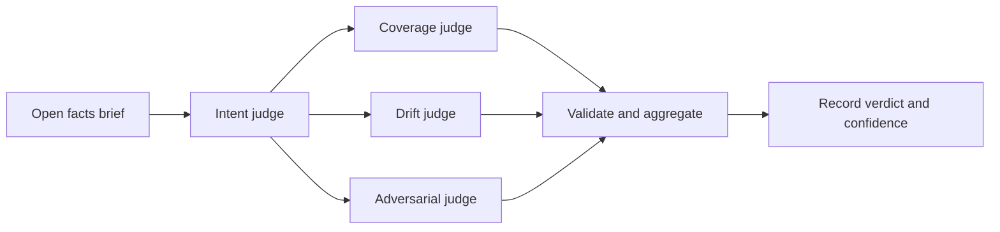

# Eval

Eval judges the current work against every open Ask and records `verdict` and
`confidence`. Invoke `/rf:eval` in Claude Code or `$rf:eval` in Codex.
The skill asks no questions and runs no project builds or tests. For Codex,
use the [explicit delegation request](../architecture/codex.md#eval-delegation)
when requesting four native judges.



## Basis and subject

An Ask is open from `ask.compiled` until cancellation or a Seal names it.
The brief lists open Asks in compilation order. Judges treat unconfirmed
candidates as context and reconstruct obligations from confirmed Asks, including
later revisions and withdrawals. Ordinary prompt text is not retained; counts
come from available hook captures and can explain otherwise unexplained changes.

Eval requires Git. Anchor selection uses an explicit `--anchor` first, then
the latest Seal's subject if it is a Git commit, then the first available base
commit among the open Asks. Otherwise it returns `eval.anchor_unknown` (exit 3).
A Seal of a dirty worktree does not itself supply a commit anchor.

The default subject is `HEAD` for a clean tree, otherwise the worktree:

| Kind | Reference | Digest |
| --- | --- | --- |
| `git_commit` | Commit ID | Git tree hash |
| `worktree` | Absolute root | SHA-256 over sorted file paths, modes, and content digests, including untracked non-ignored files |

## Judgement and aggregation

`eval open` writes a brief with Ask paths, anchor, subject digest, changed-file
counts, earlier Evals sharing an Ask, and limitations. An existing unclosed
Eval over the same Asks returns `eval.already_open`; continue with that ID.

One intent judge produces `active`, `revised`, or `withdrawn` items traced to
Asks. Three assessors (`coverage`, `drift`, `adversary`) each vote
`yes`, `no`, or `unknown` on active items and classify every changed path as
`required`, `consequence`, or `unexplained`. Judges write only their staged
output files. Codex's fallback uses sequential passes marked `shared_context`
when sub-agents are unavailable.

`eval close` requires at least three judgement files bound to the brief digest,
votes covering active items, and classifications covering changed paths. The
CLI records reported judge identity and independence; it does not authenticate
judges or prove that their contexts were separate.

| Verdict | Aggregation rule |
| --- | --- |
| `aligned` | All active items resolve to `yes`, with no unexplained path. |
| `drifted` | An item resolves to `no`, or a path resolves to `unexplained`. |
| `incomplete` | No active items, unresolved item votes without a drift finding, or a subject that changed during Eval. |

The output field `majority` uses the most frequent vote, even with more than
three judges. Item ties resolve to `unknown`; path ties resolve to `unexplained`.
Confidence is the lowest agreement among deciding questions, not a probability
of correctness. A changed subject overrides the verdict to `incomplete`.

## Records and CLI

Each `evals/<eval_id>/` holds `brief.json`, `intent.json`, `judgement-<n>.json`,
and `record.json`. The record includes votes, omission and commission findings,
limitations, and a delta from the latest completed Eval sharing an Ask.
The ledger records `eval.opened` and `eval.completed`.

```sh
ringframe eval open --json
ringframe eval close --eval <eval_id> --intent @intent.json \
  --judgement @coverage.json --judgement @drift.json --judgement @adversary.json --json
ringframe eval list --json
```

Eval never blocks [Seal](seal.md). Its current skill behavior still needs
host qualification; deterministic aggregation tests do not qualify model judgement.
