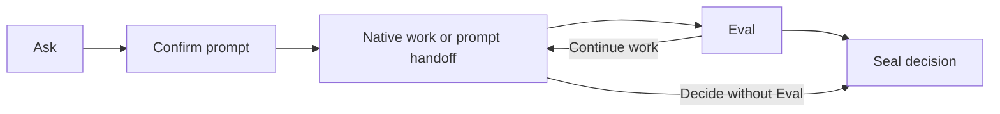

# Product contract

RingFrame connects explicit intent, evaluation, and decisions inside a native
AI coding host. The 0.0.1 source provides a Python CLI and separate Claude Code
and Codex plugins, each named `rf`.

| Operation | Durable result |
| --- | --- |
| [Ask](ask.md) | Source intent, compiled prompt, confirmation, and delivery observations |
| [Eval](eval.md) | Judgement of a Git subject against all open Asks, with confidence |
| [Seal](seal.md) | Decision closing the open Asks, with an optional Eval reference |

This is a typical use, not a required workflow. Ordinary conversation can
continue between commands. Eval requires open Asks; Seal can close them without
an Eval. Compiled, unconfirmed candidates remain visible as context until
cancelled or sealed.

## Ownership

| RingFrame | Native host |
| --- | --- |
| Preserve staged intent and prompt bytes | Discover project context |
| Select directives and record a capability route | Choose tools, workflow, and execution sequence |
| Record confirmation and delivery evidence | Manage conversation, permissions, and approvals |
| Bind judgements to a recorded subject | Perform the requested work |
| Record an attributable decision | Execute separately authorized external effects |

The CLI validates records and aggregates submitted judgements. Skills guide
routing, confirmation, and judging; their instructions do not enforce host
behavior. The host is configured to load these skills only on explicit
invocation, but the CLI remains callable independently.

## Boundaries

- Records live in the consumer workspace's `.fab7/rf/`, ignored by Git by
  default. See [Ledger](../architecture/ledger.md) for layout and retention.
- RingFrame does not maintain reusable project memory, impose development
  phases, retry the host, merge, publish, or deploy.
- Delivery evidence describes activation or submission, not completion.
- Eval confidence measures judge agreement, not probability of correctness.
- Seal records a caller's decision. Downstream systems choose their own gates.

## Evidence scope

The current judged Eval and revised skill text need fresh host qualification.
Earlier results are bounded observations of earlier artifacts, not acceptance
of the 0.0.1 release candidate. See the [Claude Code](../architecture/claude-code.md)
and [Codex](../architecture/codex.md) notes. Deterministic tests cover the core
mechanisms; they do not establish prompt quality or host behavior.
